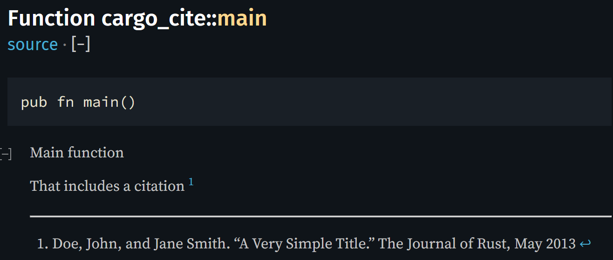

# cargo-cite

[](https://github.com/contagon/cargo-cite/actions/workflows/rust.yml)
[](https://crates.io/crates/cargo-cite)

This is a simple cargo command that emulates the functionality of bibtex citing in latex, but for rust documentation. After installation, the command 
```bash
cargo cite --bib ref.bib
```
takes in a bib file and transforms the crate documentation to include the proper citations. E.g. it transforms this
```rust
/// Main function
/// 
/// That includes a citation [^@simple]
fn main() {
    ...
};
```
to this
```rust
/// Main function
/// 
/// That includes a citation [^@simple]
/// 
/// [^@simple]: Doe, John, and Jane Smith. “A Very Simple Title.” The Journal of Rust, May 2013
fn main() {
    ...
};
```
which then using rustdoc renders as



The command can be ran consecutively and will update with any changes in documentation/citations/etc without duplications.

## Installation
```bash
cargo install cargo-cite
```

This will place `cargo-cite` in your cargo binary directory (generally `~/.cargo/bin/`). It can then be used as either `cargo cite` or `cargo-cite`.

## Usage
You can cite anything in your bib file using `[^@citekey]`, essentially your citekey inside of a footnote. `cargo cite` will then add the proper citation to the bottom of the documentation as a footnote. This allows the citation to live close to the text it is referencing. 

It additionally comes with a hand of options for citation style (see [here](https://docs.rs/hayagriva/latest/src/hayagriva/csl/archive.rs.html#340-431) for supported styles, courtesy of typst/hayagriva), verbosity, and file/folder specification.
```bash
Usage: cargo-cite [OPTIONS] --bib <BIB>

Options:
  -b, --bib <BIB>                 Bibtex file with citations
  -s, --style <STYLE>             Citation style, ie ieee, apa, chicago [default: mla]
  -m, --manifest <MANIFEST_PATH>  Cargo manifest location for other crates
  -f, --file <FILES>              Path to file or folder to format. Can be specified multiple times
  -v, --verbose                   Verbosity level
  -q, --quiet                     Silence all output
  -h, --help                      Print help
```

## Disclaimer

While well tested and used internally, `cargo cite` does read in all your source code and rewrite the ones with cite-keys. It is recommended to use version control and/or backups when using this tool.

## Contributing

If you have any issues, suggestions, or contributions, feel free to open an issue or PR. We are always looking for ways to improve the tool and make it more useful for the community. 